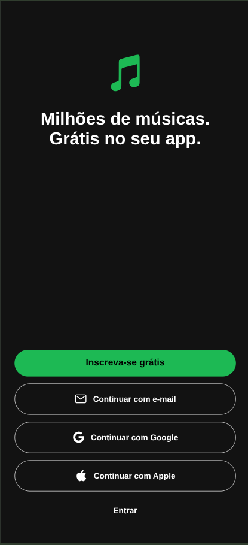
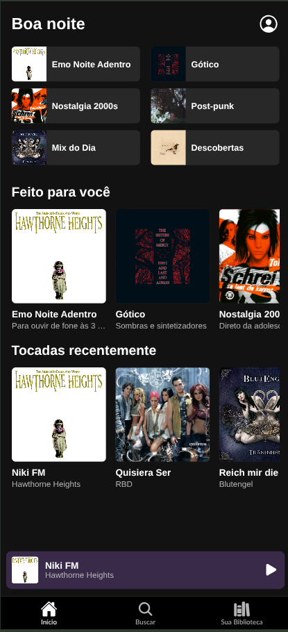
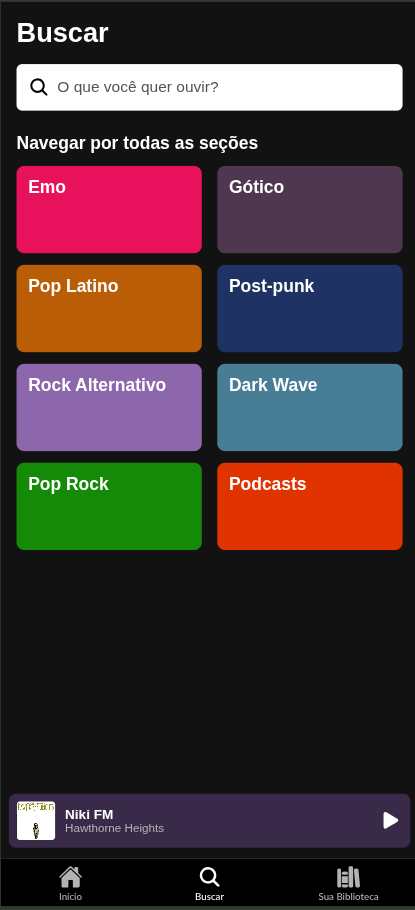
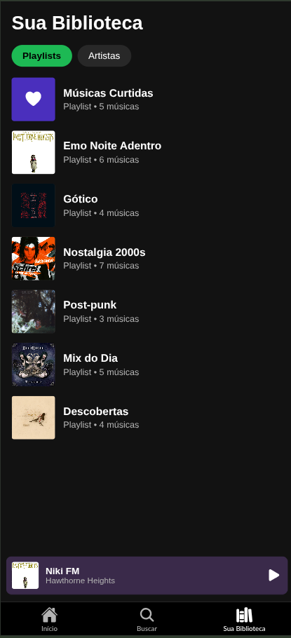
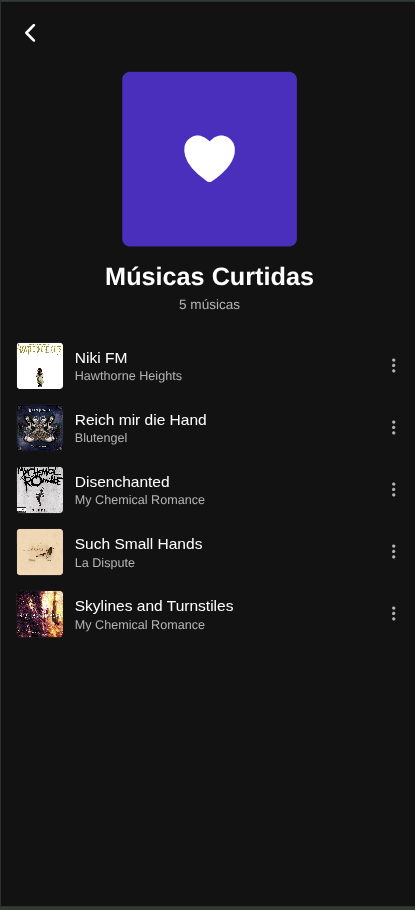
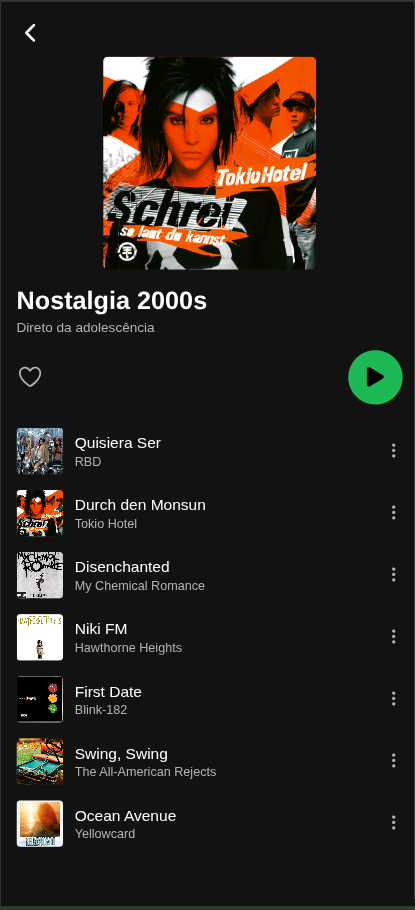
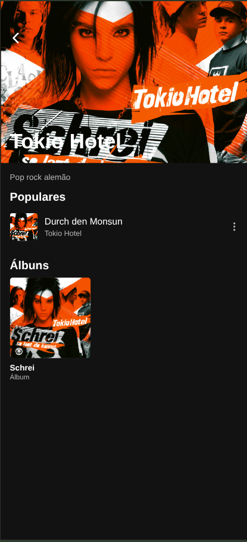
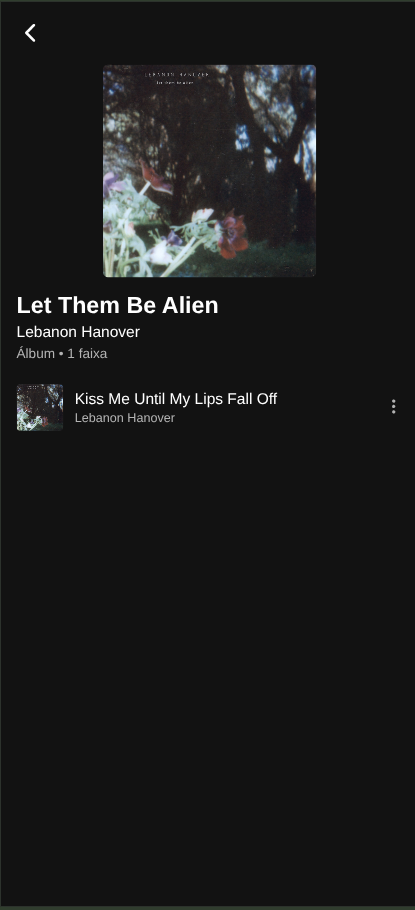
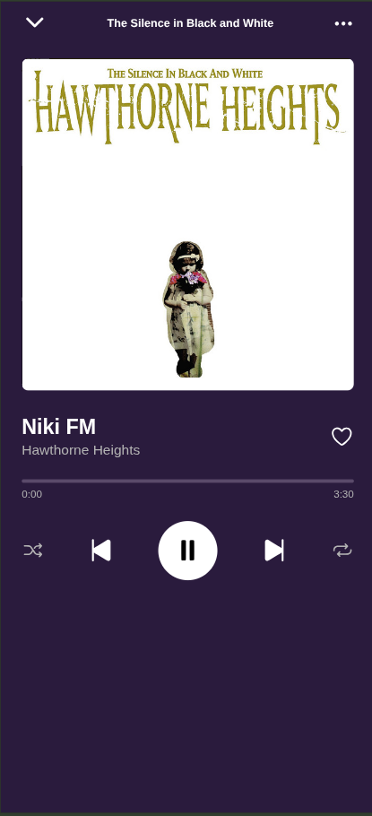
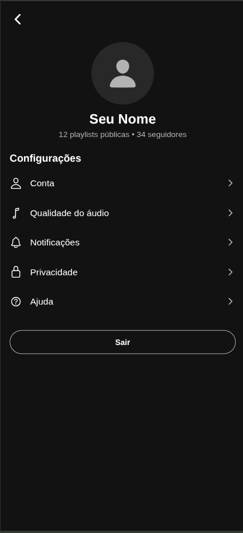

# Mockup Spotify

Clone visual do Spotify feito em React Native com Expo.

## Telas

### Login

### Início (Home)

### Buscar

### Sua Biblioteca

### Músicas Curtidas

### Playlist

### Artista

 

### Álbum

### Player

### Perfil

## Como rodar

    npm install
    npx expo start

Escaneie o QR code com o Expo Go (celular e computador na mesma rede Wi-Fi).